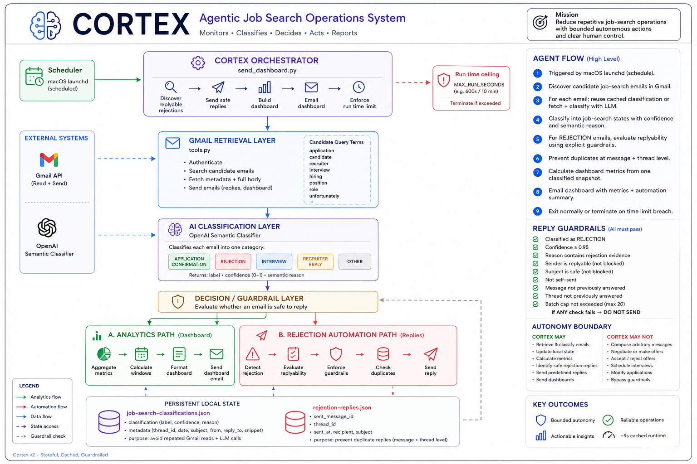

# Job Search Agent

> A stateful AI agent that monitors job-search activity in Gmail, semantically classifies recruiting emails, performs bounded autonomous actions, maintains persistent state, and delivers scheduled analytics dashboards.



---

## Overview

Job Search Agent is a personal agentic AI system built to automate repetitive operations in a high-volume job search.

Instead of manually reviewing Gmail, tracking applications and rejections, calculating job-search metrics, and responding to routine rejection emails, the agent turns incoming recruiting activity into structured state, analytics, and safe autonomous actions.

The system operates against a real Gmail account and can run automatically on schedule.

The core product question was not simply:

**"Can AI automate this workflow?"**

It was:

**"Which decisions should be automated, and where should autonomy stop?"**

---

## The Problem

A high-volume job search creates significant operational overhead:

- tracking submitted applications;
- tracking rejections;
- distinguishing recruiting emails from unrelated messages;
- monitoring recent job-search performance;
- responding to routine rejection emails;
- repeatedly reviewing Gmail for changes.

Most of this work is repetitive and low-value.

At the same time, external communication with recruiters has reputational consequences. A system that can read email is useful; a system that can send email needs explicit boundaries.

This makes the workflow a practical agentic AI problem: combining probabilistic reasoning with deterministic controls around real-world actions.

---

## Architecture


The system separates five concerns:

**Environment → Retrieval → Reasoning → Guardrails → Actions**

Gmail acts as the external environment. The agent retrieves candidate messages, uses an LLM to interpret hiring state, persists classifications locally, evaluates deterministic safety rules, and only then receives permission to act.

See the detailed architecture documentation in [`docs/ARCHITECTURE.md`](docs/ARCHITECTURE.md).

---

## Agent Flow

A scheduled run follows this sequence:

1. **Trigger** — macOS `launchd` starts the agent.
2. **Discover** — Gmail is searched for candidate job-search emails.
3. **Retrieve** — previously processed messages reuse persistent local state.
4. **Classify** — new messages are semantically classified with an LLM.
5. **Decide** — rejection emails pass through explicit deterministic guardrails.
6. **Act** — safe, predefined rejection replies may be sent autonomously.
7. **Prevent duplicates** — message and thread-level state prevents repeated actions.
8. **Analyze** — job-search metrics are calculated from the classified snapshot.
9. **Report** — the agent generates and emails a scheduled dashboard.

This creates a bounded loop:

```text
TRIGGER
   ↓
DISCOVER
   ↓
RETRIEVE
   ↓
CLASSIFY
   ↓
DECIDE
   ↓
GUARDRAILS
   ↓
ACT / SKIP
   ↓
PERSIST STATE
   ↓
ANALYZE
   ↓
REPORT
```

---

## AI Classification

Relevant emails are classified into one of five hiring states:

- `APPLICATION_CONFIRMATION`
- `REJECTION`
- `INTERVIEW`
- `RECRUITER_REPLY`
- `OTHER`

Each classification produces:

- a label;
- a confidence score;
- a short semantic reason.

The classifier evaluates the meaning of the email rather than relying only on exact keyword matching.

This allows the system to recognize semantic variants such as application acknowledgements, rejection language, interview invitations, and recruiter responses across different ATS platforms and writing styles.

---

## Bounded Autonomy

The agent intentionally does **not** have unrestricted authority.

An autonomous rejection reply is allowed only when all required guardrails pass:

- the email is classified as `REJECTION`;
- confidence meets the configured threshold;
- semantic reasoning contains rejection evidence;
- the sender is replyable;
- the subject is not blocked;
- the message is not self-sent;
- the message has not already been answered;
- the Gmail thread has not already been answered;
- the batch safety limit has not been exceeded.

If any required check fails:

**DO NOT SEND.**

### The agent may autonomously

- retrieve job-search emails;
- classify recruiting emails;
- maintain local processing state;
- calculate job-search metrics;
- identify safe rejection replies;
- send a predefined rejection response when all guardrails pass;
- deliver scheduled dashboards.

### The agent may not autonomously

- compose arbitrary recruiter messages;
- negotiate salary or employment terms;
- accept or reject offers;
- schedule interviews;
- modify job applications;
- apply for jobs;
- respond to ambiguous hiring messages;
- bypass safety rules.

The design principle is:

> Grant autonomy where the cost of a wrong action is low, the action is reversible or low-impact, and the decision can be constrained by explicit rules.

---

## Deterministic Controls Around Probabilistic AI

The LLM is used where semantic interpretation is valuable.

It does **not** have final authority over external actions.

```text
Email
  ↓
LLM classification
  ↓
Confidence + semantic evidence
  ↓
Deterministic safety checks
  ↓
Permission to act
```

This separation is intentional.

The model answers:

**"What does this email mean?"**

Application code answers:

**"Is the system allowed to do anything about it?"**

That keeps probabilistic reasoning separate from execution authority.

---

## Persistent State

The system maintains local runtime state for two purposes.

### Classification Cache

Previously processed messages store classification metadata locally.

This prevents historical email from being repeatedly fetched and reclassified on every run.

### Rejection Reply Ledger

Handled message IDs and Gmail thread IDs are persisted after an autonomous reply.

This provides idempotency and prevents duplicate responses across future runs.

Runtime state, OAuth tokens, credentials, and environment secrets are excluded from Git.

---

## Reliability Engineering

The initial implementation worked functionally but repeatedly processed historical Gmail data.

### Initial implementation

Each execution could repeat:

- Gmail searches;
- full-message retrieval;
- semantic classification;
- historical metric calculation.

Observed runtime was approximately:

**10–30 minutes**

Some scheduled executions could run significantly longer.

### Stateful implementation

The architecture was changed to:

- persist classification metadata;
- reuse existing AI classifications;
- avoid repeated historical full-message retrieval;
- calculate multiple dashboard windows from one classified snapshot.

Observed cached execution:

**~9 seconds**

Compared with a typical 10-minute run, this is approximately a **60× runtime improvement**.

The key architectural change was moving from repeated historical computation to **stateful incremental processing**.

---

## Example Production Snapshot

An August 2026 production snapshot included:

- **387** applications detected;
- **147** rejections detected;
- scheduled dashboard delivery;
- AI semantic classification;
- autonomous rejection-reply handling;
- persistent classification state;
- message-level duplicate protection;
- thread-level duplicate protection;
- approximately **9-second cached execution**.

These numbers represent a point-in-time run of the system rather than hardcoded application behavior.

---

## Technology

- **Python** — orchestration and business logic
- **OpenAI API** — semantic email classification
- **Gmail API** — email retrieval and bounded send actions
- **OAuth 2.0** — Gmail authorization
- **JSON** — local classification cache and action ledger
- **macOS launchd** — scheduled execution
- **Git / GitHub** — source control and technical documentation

---

## Repository Structure

```text
job-search-agent/
├── README.md
├── .env.example
├── .gitignore
├── LICENSE
├── requirements.txt
│
├── src/
│   ├── job_search.py
│   └── run.py
│
├── docs/
│   ├── ARCHITECTURE.md
│   └── PORTFOLIO.md
│
├── assets/
│   └── job-search-agent-architecture.png
│
└── deployment/
    └── com.stepan.job-search-agent.plist
```

Local credentials, OAuth tokens, runtime state, caches, and logs are intentionally excluded from the repository.

---

## Running Locally

### 1. Create a virtual environment

```bash
python3 -m venv .venv
source .venv/bin/activate
```

### 2. Install dependencies

```bash
pip install -r requirements.txt
```

### 3. Configure environment variables

Copy the example configuration:

```bash
cp .env.example .env
```

Then provide your own OpenAI configuration and runtime settings.

### 4. Configure Gmail OAuth

Create your own Google OAuth client credentials and place the local credentials file in the project root as:

```text
credentials.json
```

The generated OAuth token is stored locally as:

```text
token.json
```

Both files are excluded from Git.

### 5. Run the agent

```bash
python src/run.py
```

---


## Quick Start

This repository is designed to run as a personal Job Search Agent on macOS.

The setup flow is:

```text
Clone repository
    ↓
Create local environment configuration
    ↓
Add Google OAuth credentials
    ↓
Run installer
    ↓
Authorize Gmail
    ↓
Agent runs automatically on schedule
```

### 1. Clone the repository

```bash
git clone https://github.com/StepanYuschishin/job-search-agent.git
cd job-search-agent
```

### 2. Create your local configuration

Copy the example environment file:

```bash
cp .env.example .env
```

Open `.env` and configure:

```env
OPENAI_API_KEY=your_openai_api_key_here

JOB_SEARCH_AGENT_CLASSIFIER_MODEL=gpt-4.1-mini
JOB_SEARCH_AGENT_SELF_EMAIL=your_email@example.com
JOB_SEARCH_AGENT_DASHBOARD_RECIPIENT=your_email@example.com
JOB_SEARCH_AGENT_START_DATE=2026-06-22
JOB_SEARCH_AGENT_REJECTION_CONFIDENCE=0.95
JOB_SEARCH_AGENT_MAX_REPLY_BATCH=20
JOB_SEARCH_AGENT_MAX_RUN_SECONDS=600
```

Change `JOB_SEARCH_AGENT_START_DATE` to the date from which you want the agent to begin analyzing your job-search email history.

### 3. Create Google OAuth credentials

Create a Google Cloud project and enable the Gmail API.

Create OAuth credentials for a desktop application.

Download the credentials file and place it in the repository root as:

```text
credentials.json
```

Do not commit this file.

### 4. Run the installer

```bash
bash scripts/install.sh
```

The installer will:

- create a Python virtual environment;
- install dependencies;
- validate the application;
- authenticate Gmail;
- create the local OAuth token;
- install the macOS scheduler;
- run an initial smoke test.

During the first Gmail authorization, Google may open a browser window asking you to sign in and approve access.

### 5. Verify the agent

A successful installation should create:

```text
token.json
state/
job-search-agent.log
job-search-agent-error.log
```

The agent is scheduled to run automatically at:

```text
09:00
18:00
```

You can also run it manually:

```bash
.venv/bin/python src/run.py
```

### 6. Stop automatic execution

To remove the scheduled LaunchAgent without deleting your local data:

```bash
bash scripts/uninstall.sh
```

This does not delete:

- `.env`;
- `credentials.json`;
- `token.json`;
- classification state;
- rejection reply history;
- logs.

### Important

The agent has Gmail read access and bounded send access.

It may autonomously send only:

- predefined replies to high-confidence rejection emails that pass all guardrails;
- its own job-search dashboard.

It does not autonomously apply for jobs, negotiate offers, schedule interviews, or compose arbitrary recruiter messages.

## Product Decisions

Several design choices were deliberate:

**Semantic classification instead of keyword-only detection**  
Recruiting emails vary significantly across companies and ATS platforms, so semantic interpretation provides better coverage than exact phrase matching alone.

**Persistent state instead of stateless rescanning**  
Historical messages do not need to be repeatedly retrieved and classified.

**Deterministic guardrails around LLM decisions**  
The model can interpret an email, but application code controls whether an external action is permitted.

**Predefined autonomous replies instead of free-form generation**  
The system is allowed to perform a narrow, low-risk communication action rather than generate arbitrary recruiter communication.

**Thread-level idempotency**  
Preventing duplicate action requires tracking the conversation, not only an individual message.

---

## Current Scope

The current implementation focuses on the operational layer of job search:

**Gmail → hiring-state classification → persistent state → bounded actions → analytics**

Potential future extensions include application-source integrations, structured opportunity tracking, recruiter follow-up recommendations, funnel analytics, and human-approved higher-impact actions.

The autonomy boundary should expand only when additional actions can be evaluated and constrained with comparable confidence.